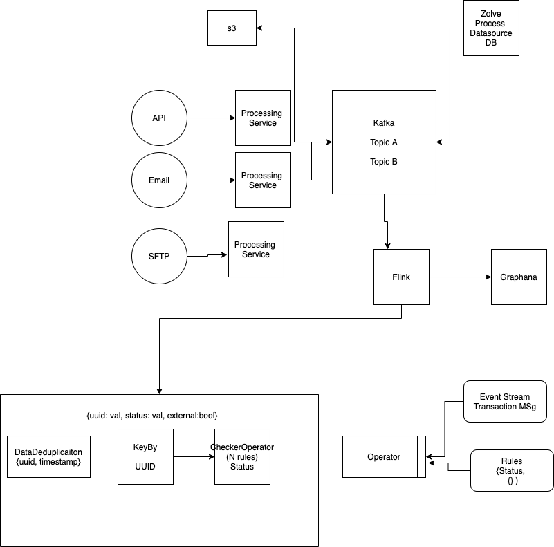
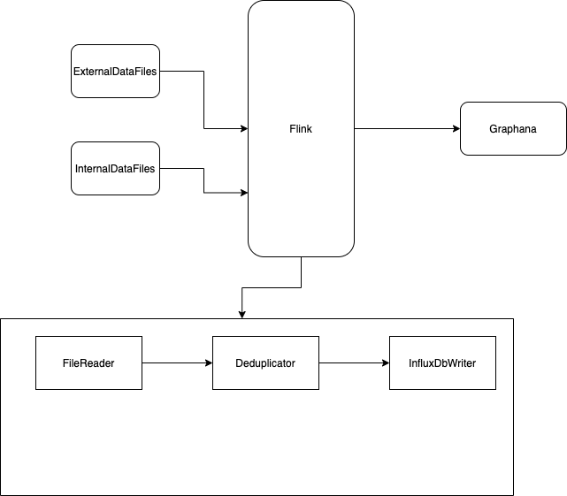
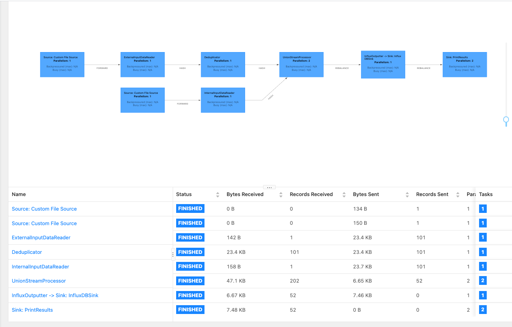
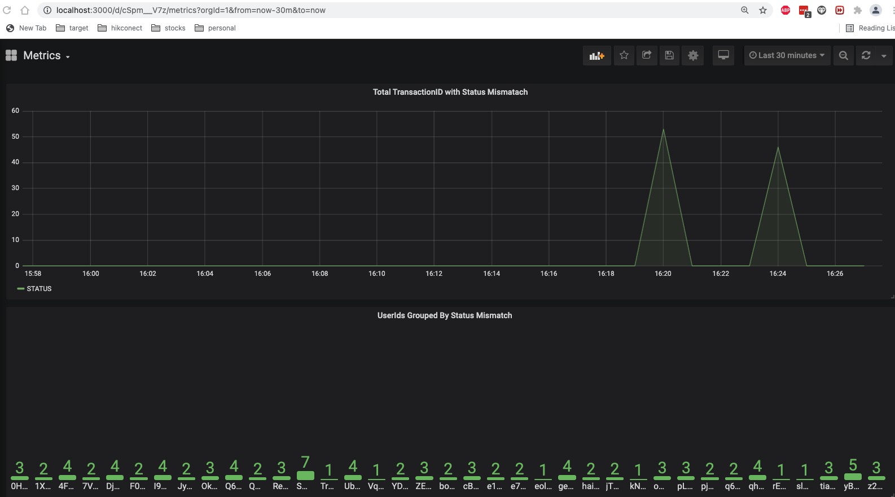

## Zolve Descrepency Detector

### Setup

- Install Flink Locally using official [documentation](https://ci.apache.org/projects/flink/flink-docs-release-1.13/docs/try-flink/local_installation/).
- Install Grafana using official [documentation](https://grafana.com/docs/grafana/latest/installation/mac/).

### Architecture

**Version 1:** Designed with idea to scale to any number of datasource and process millions of records seamlessly . 
**Version 2:** Simpler architecture for demo along with it's implementation.  

### Code Flow Diagram
Records Flows from Left to Right as show in DAG and Records Processed metrics are in table below DAG.


### Detailed Code Walkthrough

1. **MainJob**: Starting point of application where all necessary DAG setups are done.
2. **ExternalInputDataReader**: File reader to read data from external vendors like Banks, Third-party uploaded in JSON format.
   ```json
   {"timestamp": 1630751425757, "userId": "mDoTI7BQ", "transactionId": "22285554-0878-46d8-be36-afda68b14063", "fromAccount": 6, "toAccount": 9, "transactionType": "deposit", "status": "failed", "amount": 0, "datasource": "external"}
   ```
3. **InternalInputDataReader**: File reader to read data from Zolve internal DB transformed and written as JSON rows.
   ```json
   {"timestamp": 1630751452380, "userId": "9BE9SshU", "transactionId": "59297af5-1b8a-4c4b-9e74-69d9f0f6153f", "fromAccount": 8, "toAccount": 6, "transactionType": "deposit", "status": "delivered", "amount": 5, "datasource": "external"}
   ```
4. **Deduplicator**: Operator which helps to filter duplicates message within time window of 10 millisecond.
   ```json
   {"timestamp": 1630751452380, "userId": "9BE9SshU", ....} --> Record1
   {"timestamp": 1630751452380, "userId": "9BE9SshU", ....} --> Record2
   As both records are exactly same we are using timestamp + userId combination to filter messaages
   ```
5. **UnionStreamProcessor**: Operator which merges both external and internal stream, compares record by status for give userId and transactionId. If they differs it marks it as inconsistent and sends it for InfluxDB.
   ```json
   {"timestamp": 1630751452380, "userId": "9BE9SshU", "transactionId": "59297af5-1b8a-4c4b-9e74-69d9f0f6153f", "fromAccount": 8, "toAccount": 6, "transactionType": "deposit", "status": "delivered", "amount": 5, "datasource": "external"}
   {"timestamp": 1630751452380, "userId": "9BE9SshU", "transactionId": "59297af5-1b8a-4c4b-9e74-69d9f0f6153f", "fromAccount": 8, "toAccount": 6, "transactionType": "deposit", "status": "failed", "amount": 5, "datasource": "internal"}
   ```
   In above example if we compare status field records from ***external*** system is marked with delivery status as ***delivered*** whereas in our ***internal*** system we have captured it as ***failed***.
6. **InfluxOuputter**: In order to send this result to Grafana we are conversion JavaObject to Influx Line Protocol.
   ```json
   status_metrics,status=STATUS userId=9BE9SshU 1465839830100400200
   ```
### Grafana Metrics


- First panel in above snapshot show total number of transactions grouped by status in past 30 minutes have inconsistent status.
- Second panel in above snapshots show total number of inconsistent status grouped by userid in past 30 minutes.
